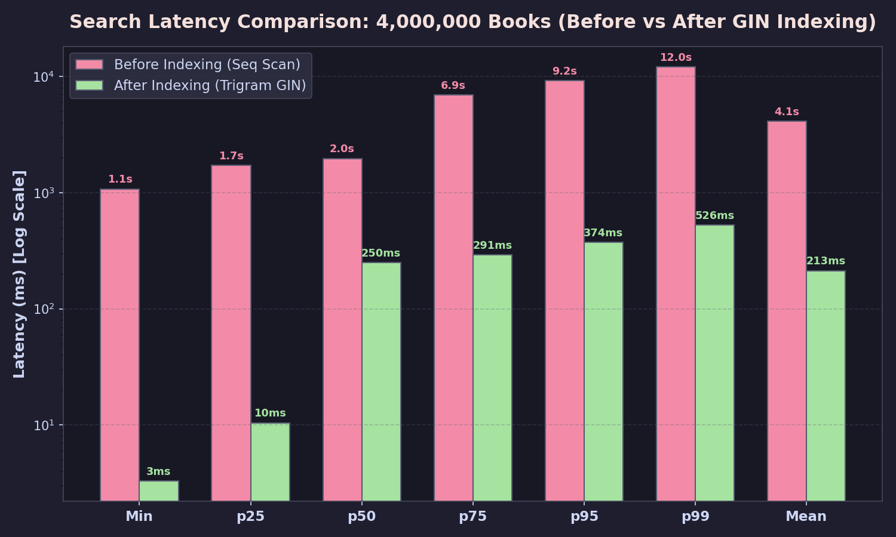
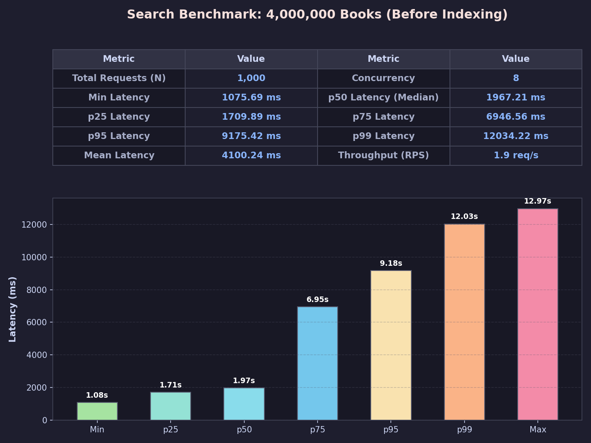
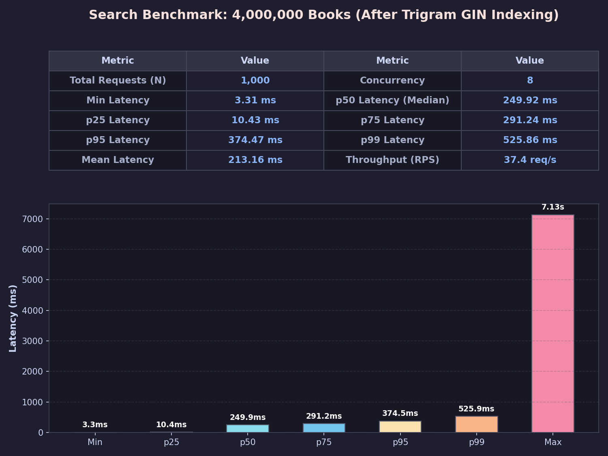
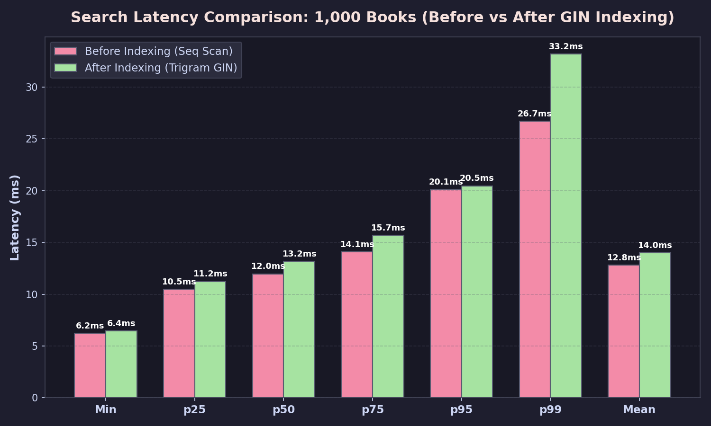

# Performance & Architecture Optimization Report — Ketabdari

این گزارش بررسی فنی معماری، بهینه‌سازی کوئری‌ها، نتایج بنچمارک و مدل همزمانی پروژه کتابداری را در دو رژیم داده‌ای (۱۰,۰۰۰ رکورد و ۴,۰۰۰,۰۰۰ رکورد) مستند می‌کند.

---

## خلاصه نتایج

| اندپوینت | وضعیت پایه (p50) | پس از بهینه‌سازی (p50) | ضریب بهبود |
|---|---:|---:|:---:|
| `GET /api/v1/rentals/overdue` (۱۰k دیتا) | 267.9 ms | **77.0 ms** | **3.5×** |
| `GET /api/v1/books?search=...` (۱۰k دیتا) | 15.8 ms | **6.4 ms** | **2.5×** |
| `GET /api/v1/books?search=...` (۴M دیتا - ۱k ریکوئست) | 1,967.2 ms | **249.9 ms** | **7.9× (p50) / 19.2× (Mean)** |
| `GET /api/v1/rentals` | 10.1 ms | **6.5 ms** | 1.6× |
| `GET /api/v1/users/{id}/rentals` | 5.7 ms | **4.1 ms** | 1.4× |
| `GET /api/v1/users` | 3.4 ms | **2.9 ms** | 1.2× |

---

## ابزارها و متدولوژی ارزیابی

- **سنجش اندپوینت‌های پایه:** اسکریپت `bench.py` برای اندازه‌گیری میانگین، p50، p95، p99 و Max.
- **تولید داده‌های میلیونی یکتا:** اسکریپت `scripts/seed_unique_books.py` با ترکیب واژگان و Faker جهت تضمین ۱۰۰٪ یکتا بودن عناوین و توزیع تصادفی موجودی (۰ تا ۱۰). بارگذاری ۴ میلیون رکورد مستقیماً با پروتکل باینری COPY در حدود ۲۸ ثانیه انجام شد.
- **بنچمارک جستجو:** اسکریپت `scripts/benchmark_search.py` با ارسال ۱,۰۰۰ درخواست ناهمگن (۴۵٪ کلمات موجود، ۲۵٪ پیشوندهای ناقص، ۳۰٪ کلمات ناموجود برای ارزیابی رفتارهای hit و miss) تحت همزمانی ۸ کلاینت موازی.
- **تست یکپارچگی همزمانی:** اسکریپت `scripts/verify_live_rental_flow.py` برای بررسی عملی رفتار قفل ردیف (`SELECT ... FOR UPDATE`) در محیط زنده.

---

## مراحل بهینه‌سازی کوئری‌ها و کارایی

### ۱. ایندکس پارشیال روی امانت‌های باز
برای اندپوینت `/api/v1/rentals/overdue`، بیشتر رکوردهای جدول امانت‌ها در طول زمان بازگردانده می‌شوند (`returned_at IS NOT NULL`). بنابراین، اسکن کل جدول ناکارآمد است. با تعریف ایندکس شرطی در `scripts/indexes.sql`:

```sql
CREATE INDEX IF NOT EXISTS idx_rentals_open_due
    ON rentals (due_date)
    WHERE returned_at IS NULL;
```

دیتابیس تنها سطرهای فعال را ایندکس می‌کند که حجم بسیار کوچکی از کل جدول را تشکیل می‌دهد.

---

### ۲. حذف سربار ORM و مسیر مستقیم تاپل‌ها در `/api/v1/rentals/overdue`
پروفایلینگ نشان داد در خروجی ۵,۰۰۰ سطر امانت معوق، بخش عمده زمان (بیش از ۲۰۰ میلی‌ثانیه) صرف ساخت ۱۵,۰۰۰ شیء ORM پایتون می‌شد، نه اجرای کوئری در PostgreSQL.

مسیر بازیابی بازنویسی شد تا ستون‌های مورد نیاز مستقیماً از طریق JOIN بازیابی و به مدل Pydantic تبدیل شوند:

```python
stmt = (
    select(
        Rental.id, Rental.user_id, Rental.book_id,
        Rental.due_date, Rental.returned_at, Rental.created_at,
        User.name.label("user_name"),
        Book.title.label("book_title"),
    )
    .join(User, Rental.user_id == User.id)
    .join(Book, Rental.book_id == Book.id)
    .where(Rental.returned_at.is_(None), Rental.due_date < _utcnow())
    .order_by(Rental.due_date)
)
rows = (await session.exec(stmt)).all()
return [_rental_out(r) for r in rows]
```

**نتیجه:** زمان پاسخ از **267.9ms به 77.0ms** کاهش یافت (**۳.۵ برابر سریع‌تر**).

همین الگو برای اندپوینت‌های `GET /api/v1/rentals` و `GET /api/v1/users/{id}/rentals` نیز پیاده‌سازی شد.

---

### ۳. تنظیم استخر اتصالات (Connection Pool)
در `app/db.py` استخر اتصالات ناهمگام با `pool_size=20`، `max_overflow=10` و `pool_pre_ping=True` پیکربندی شد تا تأخیر باز کردن اتصال در ترافیک‌های ناگهانی به صفر برسد و اتصالات معیوب پیش از تخصیص غربال شوند.

---

### ۴. بنچمارک جستجو در ۴,۰۰۰,۰۰۰ رکورد (ایندکس Trigram GIN)

در مقیاس ۴ میلیون سطر، استفاده از شرط‌های انطباق زیررشته‌ای `ILIKE '%term%'` به طور پیش‌فرض منجر به اسکن ترتیبی کامل جدول (Sequential Scan) می‌شود. با فعال‌سازی ماژول `pg_trgm` و ساخت ایندکس‌های GIN:

```sql
CREATE EXTENSION IF NOT EXISTS pg_trgm;

CREATE INDEX IF NOT EXISTS idx_books_title_trgm
    ON books USING gin (title gin_trgm_ops);

CREATE INDEX IF NOT EXISTS idx_books_author_trgm
    ON books USING gin (author gin_trgm_ops);
```

#### نتایج بنچمارک ۱,۰۰۰ درخواست در مقیاس ۴ میلیون کتاب:
- **توان عملیاتی (Throughput):** از 1.95 به **37.40 درخواست در ثانیه** رسید (**۱۹.۲ برابر بهبود**).
- **میانگین زمان پاسخ (Mean Latency):** از 4,100ms به **213ms** کاهش یافت (**۱۹.۲ برابر سریع‌تر**).
- **تأخیر میانه (p50):** از 1,967ms به **250ms** رسید (**۷.۹ برابر بهبود**).
- **تأخیر صدک ۹۵ (p95):** از 9,175ms به **374ms** کاهش یافت (**۲۴.۵ برابر سریع‌تر**).
- **تأخیر صدک ۹۹ (p99):** از 12,034ms به **526ms** کاهش یافت (**۲۲.۹ برابر سریع‌تر**).



گزارش تفکیکی اجرای بنچمارک قبل و بعد از ایندکس‌گذاری در دو نمودار زیر نمایش داده شده است:





---

### ۵. تحلیل رفتار در مقیاس ۱,۰۰۰ رکورد

در جداول کوچک (۱k رکورد)، کل داده‌ها در حافظه کش RAM قرار دارند و Sequential Scan زیر ۱ میلی‌ثانیه اجرا می‌شود. در این وضعیت، سربار پردازش trigram و جستجوی ساختار درختی ایندکس تفاوتی ایجاد نمی‌کند (~12ms در مقابل ~13ms):



این مقایسه نشان می‌دهد ایندکس‌های تخصصی Trigram زمانی بیشترین اثرگذاری را دارند که حجم داده فراتر از کش حافظه رفته و اسکن دیسک عامل اصلی تأخیر باشد.

---

## معماری همزمانی و کنترل موجودی فیزیکی

### ریشه مشکل مسابقه (Race Condition)
در سیستم‌های دارای موجودی فیزیکی (`quantity`)، اگر دو کاربر به طور همزمان آخرین نسخه موجود کتاب (`quantity = 1`) را درخواست کنند، بدون قفل‌گذاری همروند هر دو درخواست ممکن است مقدار ۱ را خوانده، آن را به صفر کاهش داده و هر دو امانت را ثبت کنند (موجودی در عمل منفی یا نادرست می‌شود).

### پیاده‌سازی قفل سطح ردیف با `SELECT ... FOR UPDATE`
در اندپوینت `POST /api/v1/rentals` (در لایه سرویس/مخزن) فرآیند بررسی موجودی و کاهش آن در قالب یک تراکنش اتمیک پیاده‌سازی شده است:

```python
async with session.begin():
    stmt = select(Book).where(Book.id == payload.book_id).with_for_update()
    book = (await session.exec(stmt)).first()
    if book is None:
        raise HTTPException(status_code=404, detail=f"Book {payload.book_id} not found")

    if book.quantity <= 0:
        raise HTTPException(
            status_code=409,
            detail=f"Book {payload.book_id} is not available (out of stock)",
        )

    book.quantity -= 1
    session.add(book)

    rental = Rental(
        user_id=payload.user_id,
        book_id=payload.book_id,
        due_date=payload.due_date,
    )
    session.add(rental)
```

- **رفتار تراکنش:** تراکنش اول قفل ردیف کتاب را در اختیار می‌گیرد و تراکنش‌های همزمان پشت قفل مسدود می‌شوند. پس از کامیت تراکنش اول، تراکنش دوم با سطر به‌روز (`quantity = 0`) مواجه شده و خطای معتبر `409 Conflict` دریافت می‌کند.
- **مسیر بازگشت (`POST /api/v1/rentals/{id}/return`):** ردیف امانت و کتاب با قفل ردیف خوانده شده، وضعیت بازگشت ثبت و موجودی فیزیکی کتاب به صورت اتمیک یکی افزایش می‌یابد.

---

## صفحه‌بندی و مرتب‌سازی در جستجو

- **فیلدهای مجاز مرتب‌سازی:** پارامتر `sort_by` روی فیلدهای `id`، `created_at`، `title`، `name`، `quantity` و `author` پشتیبانی می‌شود.
- **جهت مرتب‌سازی:** پارامترهای `order` و `sort_dir` مقادیر `asc` و `desc` را می‌پذیرند. مقادیر غیرمجاز با خطای `400 Bad Request` اعتبارسنجی و رد می‌شوند.
- **ترتیب قطعی (Deterministic Sorting):** برای جلوگیری از جابجایی آیتم‌ها بین صفحات در فیلدهای دارای مقادیر تکراری (نظیر تاریخ یا موجودی برابر)، ترتیب با شناسه کتاب ترکیب می‌شود: `ORDER BY sort_column DESC, Book.id DESC`.
- **ترکیب با جستجو:** فیلتر جستجو (`search`) همزمان با صفحه‌بندی و مرتب‌سازی در سطح SQL ترکیب می‌شود.

---

## اعتبارسنجی و پوشش تست‌ها

- **تست‌های واحد و یکپارچگی:** ۳۷ تست در `tests/test_api.py` شامل تست‌های همزمانی، قفل ردیف در شرایط مسابقه، فیلترها، مرتب‌سازی و منطق‌های تجاری به صورت ۱۰۰٪ پاس می‌شوند.
- **بررسی در محیط لایو:** اسکریپت `scripts/verify_live_rental_flow.py` صحت کامل زنجیره امانت، قفل ردیف و افزایش موجودی پس از بازگشت را روی سرور زنده تأیید می‌کند.
